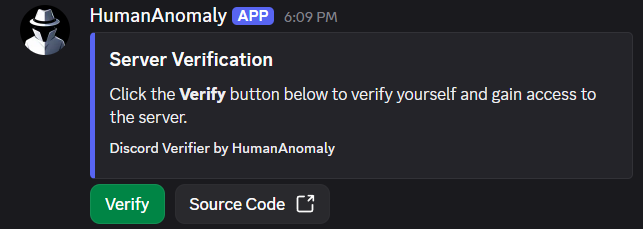
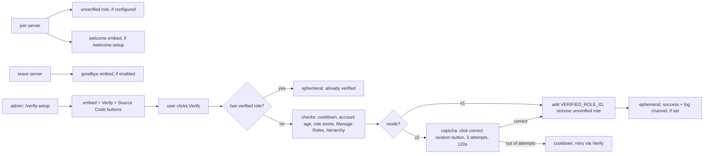

<p align="center">
  
</p>

<h1 align="center">Discord Verifier</h1>

<p align="center">
  Lightweight Discord verification bot with a Verify button.
</p>

<p align="center">
  <a href="https://github.com/HumanAnomaly/DiscordVerifier"></a>
  <a href="https://github.com/HumanAnomaly/DiscordVerifier/blob/main/LICENSE"></a>
  
  
</p>

> **Simple / Starter** Admin runs `/verify-setup` once, users click **Verify**, bot assigns the verified role.


<p align="center">
  
  <br>
  <sub>Example of the Discord Verifier verification panel.</sub>
</p>

## Install

```bash
npm i
cp .env.example .env
npm run deploy
npm start
```

---

| Variable | Description |
|---|---|
| `DISCORD_TOKEN` | Bot token |
| `CLIENT_ID` | Application ID |
| `GUILD_ID` | Server ID |
| `VERIFIED_ROLE_ID` | Role granted on verify |
| `UNVERIFIED_ROLE_ID` | Optional. New members get it on join, lose it on verify. Hide locked channels from this role via deny View Channel |

Node 18+. Intents: `Guilds` + `GuildMembers` (privileged, enable Server Members Intent in the portal).


---

### Invite

Invite with `bot` + `applications.commands` scopes and Manage Roles (`268435456`):

```
https://discord.com/oauth2/authorize?client_id=YOUR_CLIENT_ID&permissions=268435456&scope=bot%20applications.commands
```

Bot role must sit above the verified role in Server Settings → Roles.

## Usage

| Script | Description |
|---|---|
| `npm run deploy` | Register guild commands |
| `npm start` | Start the bot |
| `npm run dev` | Start with `--watch` |

| Command | Description |
|---|---|
| `/verify-setup [channel]` | Seed the verification panel here or in the target channel (Administrator-only) |
| `/verify-mode <v1\|v2>` | Switch verification version: v1 direct, v2 random-button captcha (Administrator-only) |
| `/welcome-setup <channel> [enable] [goodbye]` | Welcome + goodbye embeds (Administrator-only) |
| `/verify-config [log-channel] [min-account-age-days] [cooldown-seconds]` | View/change log, account-age gate, cooldown (Administrator-only) |
| `/verify-status` | Full config + health check: IDs, roles, permission, hierarchy, channel, mode/settings (Administrator-only) |
| `/verify-help` | List commands (Administrator-only) |

> Settings from `/verify-mode`, `/welcome-setup`, `/verify-config` are stored per-server in `data/settings.json` (gitignored). Defaults = v1 behaviour (no captcha, no welcome, no log, no age gate, 10s cooldown).

## How it works



## Structure

```
src/                  index · deploy-commands
src/commands/         verifySetup · verifyStatus · verifyHelp · verifyMode · welcomeSetup · verifyConfig
src/events/           interactionCreate · ready · guildMemberAdd · guildMemberRemove
src/utils/            config · constants · settings · captcha · cooldown · welcome · verifyLog
data/                 settings.json (runtime, gitignored)
```

## License

MIT, see [LICENSE](LICENSE).
